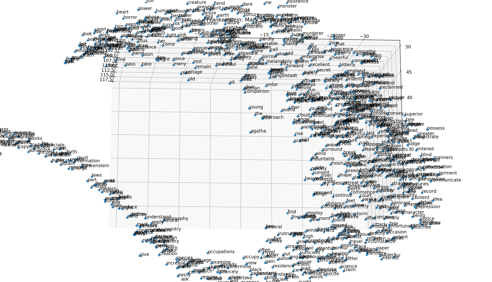

# Word2Vec_Frankenstein
## Using gensim's Word2Vec algorithm for natural language processing, we can more easily understand common themes in the literary classic: Frankenstein by Mary Shelley
### Requirements:
- Python 2.7
- gensim 3.6
- nltk 3.3
- pandas 0.23
- sklearn 0.19
- matplotlib 2.2
### The python script follows dropping common words, lemmatization, and other noise removal methods.It then projects the remaining corpus into a vector space, normalizations the values, and reduces the dimensions to 3 for plotting purposes.At this point, we can see the emerging motifs and word associations that summarize the nature of the book. I encourage the reader to download the .txt and .py file, play around with the parameters, and experience the 3D interaction for themselves.

#### The image files show the clustering differences between L1 and L2 normalization before we transform the data with t-SNE. We see L2's effects on the blob's clear pattern suggesting greater stability yet its elongated shape suggests the influence of outliers.

### Special thanks to the Project Gutenberg for supplying the text file.
